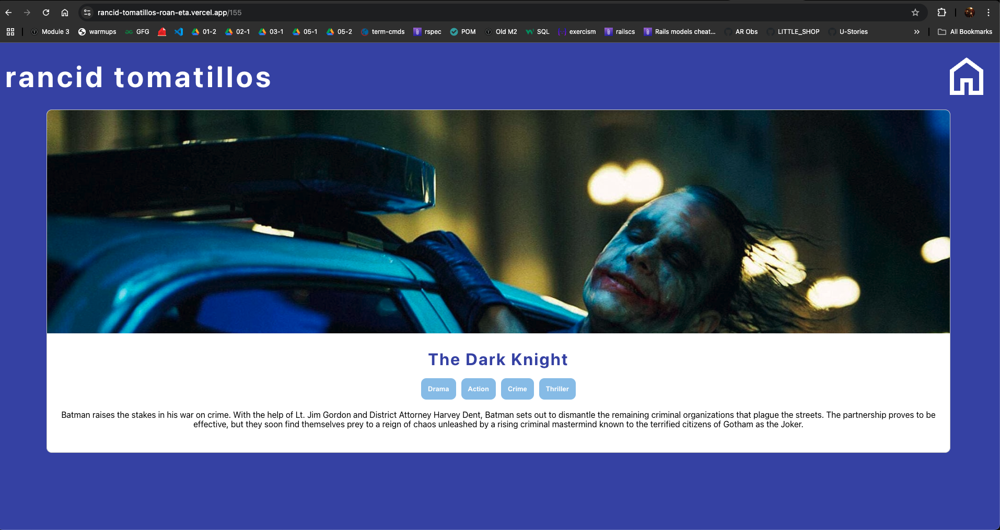
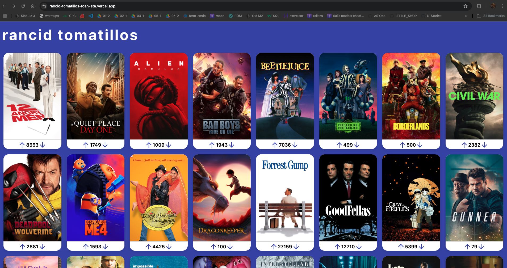

# Rancid Tomatillos - Starter Repo

## [The project spec for Rancid Tomatillos can be found here.](https://curriculum.turing.edu/module3/projects/rancid-tomatillos)

## Set Up

1.  Fork this repo
2.  Clone **and rename** this repo: `git clone [remote-address] [new-name]`  
    For example: `git clone git@github.com:turingschool-examples/rancid-tomatillos-starter.git rancid-tomatillos`
3.  `cd` into the directory
4.  Install necessary dependencies with `npm install`
5.  Run your React app with `npm start`
6.  Go to `http://localhost:3000/` and you should see a page with some starter elements
7.  Enter `control + c` in your terminal to stop running the React app at any time
8.  To run Cypress tests, use `npx cypress open`

## Collaborators:

https://github.com/MDelarosa1993
https://github.com/litobot

## Deployed Link:

https://rancid-tomatillos-roan-eta.vercel.app

## Screenshots:

## Overview of Project & Goals:

1. This application provides users with a simple way to view popular movies at a glance with their current collective rating by all users visiting the app.

2. Users can upvote or downvote movies as they see fit and the modified vote counts persist upon a page refresh.

3. Users can click a desired movie to view more details about it including an additional image, listed genres, and a brief overview of the movie's plot.

4. This application was built using React, React Router, and was end-to-end tested via Cypress utilizing API call interception and stubbed data to prevent unnecessary calls. We chose to deploy using Vercel as it was smooth and seamless.

5. Challenges: 

- We had some mismatches in scheduling due to being in different time zones and personal/family responsibilities. However, we synced for work over 90% of the time and made decent progress.

- Steep learning curve with React, React Router, and Cypress. That was a lot all at once.

6. Wins:

- Implementing Cypress and React Router effectively.

- Getting to work together and get to know each other better! <3

- Got some fun styling practice. It's nice to build something worth looking at.

- Getting more experience deploying.

7. Reflections:

- It seems like the rumors surrounding learning React regarding the steep learning curve are accurate.  There's a lot of stuff to get used to upfront, but it's clear once those are conquered, it's relatively straightforward.
